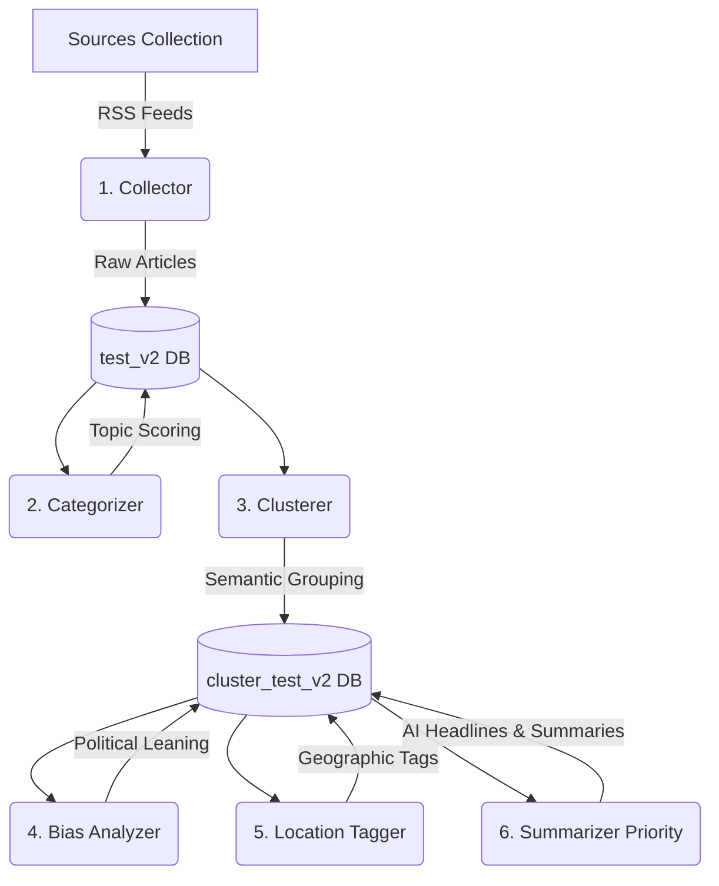

# 📰 Edified News Pipeline (Scraper V2)

Welcome to the heart of **The Edified** news aggregation platform. `scraperv2` is a modern, AI-driven, highly scalable Python backend designed to ingest, process, cluster, and analyze thousands of news articles daily while rigorously respecting API rate limits.

---

## 🏗️ Pipeline Architecture

The pipeline operates in a sequence of specialized stages, managed by the **`orchestrator.py`**. The workflow is designed to be resilient, ensuring that data is preserved and enhanced at each step.



---

## 🛠️ Tech Stack & Core Dependencies

*   **Language:** Python 3.10+
*   **Database:** MongoDB Atlas (via `pymongo`)
*   **Web Extraction:** `newspaper3k`, `feedparser`, `requests`, `BeautifulSoup4`
*   **Machine Learning / NLP:** 
    *   `sentence-transformers` (`all-MiniLM-L6-v2` for semantic clustering)
    *   `hdbscan` (Density-based clustering algorithm)
    *   `transformers` & `torch` (HuggingFace `politicalBiasBERT` for bias analysis)
*   **Large Language Models (LLMs):**
    *   **Groq API** (`llama-3.1-8b-instant`) — Primary: Ultra-fast, cheap summarization.
    *   **Google Gemini API** (`gemini-2.0-flash`) — Fallback: Automated rate-limit protection.

---

## 🔄 The Pipeline Stages In Detail

### 1. 📥 Data Collection (`collector.py`)
*   **Input:** RSS feed URLs from MongoDB (`sources` collection).
*   **Action:** Fetches feeds in parallel using an 8-thread `ThreadPoolExecutor`. Decodes obfuscated Google News redirect URLs to find the actual publisher link. Downloads full HTML content, extracting the main text, publish dates, and hero images using `newspaper3k`.
*   **Deduplication:** Prevents identical articles from polluting the database using an MD5 hash of the article title.
*   **Output:** Saves raw articles to the `test_v2` collection.

### 2. 🏷️ Categorization (`categorizer.py`)
*   **Input:** Raw articles from `test_v2`.
*   **Action:** Scans the title, snippet, and the first 500 characters of the article content against a weighted keyword dictionary. Supports both **English and Hindi** keywords.
*   **Scoring:** Each category (General, Politics, Sports, Business, etc.) accumulates points. The highest score wins, eliminating the flaws of "first-match" regex tagging.
*   **Output:** Updates the `category` field on raw articles.

### 3. 🧠 Semantic Clustering (`clusterer.py`)
*   **Input:** Categorized articles from `test_v2`.
*   **Action:** Groups individual articles discussing the exact same real-world event into unified "Stories" (Clusters).
*   **Mechanism:** Combines the title and first 200 characters to generate mathematical embeddings via `sentence-transformers`. These are clustered using **HDBSCAN** and cosine distance.
*   **Preservation (Upsert):** Generates a unique "content fingerprint" for each cluster. Instead of wiping the database on every run, it **UPSERTS** the clusters. This preserves previously generated AI summaries while allowing breaking news articles to join existing stories.
*   **Output:** Writes unified clusters to the `cluster_test_v2` collection.

### 4. ⚖️ Bias Analysis (`bias_analyzer.py`)
*   **Input:** Unified clusters from `cluster_test_v2`.
*   **Action:** Calculates the political leaning (Left, Center, Right) of every article within a cluster.
*   **Mechanism:** Loads the `politicalBiasBERT` model locally. Uses **Batched Inference** (processing 16 articles simultaneously) to drastically reduce execution time.
*   **Output:** Aggregates individual scores to create a `biasDistribution` object on the cluster.

### 5. 📍 Location Tagging (`location_tagger.py`)
*   **Input:** Articles and Clusters.
*   **Action:** Assigns geographical metadata to power the frontend Location map and feeds.
*   **Mechanism:** A highly precise, zero-cost regex script. Operates **strictly on the title** to prevent false positives (e.g., stopping a Delhi local story from being tagged as "Uttar Pradesh" just because the UP CM was mentioned). Automatically tags Indian news (non-World categories) as "All India".
*   **Output:** Appends to the `locations` array on articles and clusters.

### 6. ✨ AI Summarization (`summarizer_priority.py`)
*   **Input:** High-value clusters from `cluster_test_v2`.
*   **Action:** Generates a professional 3-point bulleted summary and a punchy editorial headline.
*   **Mechanism:** 
    *   **Token-Efficient:** Targets only high-priority clusters (3+ articles). Truncates article contexts to 150 words to keep prompts tiny.
    *   **Primary LLM:** Calls Groq (`llama-3.1-8b-instant`) asking for a strict structural format.
    *   **Fallback:** Automatically routes to Google Gemini if Groq rate limits (429 errors) are hit.
*   **Output:** Populates `summary` and `generatedHeadline` fields. Maintains a `summarizer_checkpoint.json` file to safely resume interrupted runs.

---

## ⚙️ Configuration & Setup

All configuration is centralized in `config.py`. Ensure you have a `.env` file in the `scraperv2` directory with the following variables:

```env
MONGO_URI="mongodb+srv://<user>:<pass>@cluster..."
DB_NAME="news_aggregator"

GROQ_API_KEY="gsk_..."
GEMINI_API_KEY="AIzaSy..."

# Optional: For downloading models faster
HF_TOKEN_1="hf_..."
```

---

## 🚀 Execution Guide

The entire system is controlled via `orchestrator.py`.

### Automated Data Gathering
Run the standard pipeline (Collect $\rightarrow$ Categorize $\rightarrow$ Cluster $\rightarrow$ Bias $\rightarrow$ Location). This is safe to run frequently as it preserves AI summaries.
```bash
python scraperv2/orchestrator.py
```

**Run continuously (Every 2 hours):**
```bash
python scraperv2/orchestrator.py --loop
```

### Manual/Scheduled AI Summarization
Because LLM APIs have strict rate limits, summarization is decoupled from the main automated loop. Run this **once daily** (or via a separate cron job) to summarize new breaking stories:
```bash
python scraperv2/orchestrator.py --stage summarize_priority
```

### Debugging Individual Stages
You can isolate any step of the pipeline if you need to test changes:
```bash
python scraperv2/orchestrator.py --stage collect
python scraperv2/orchestrator.py --stage cluster
python scraperv2/orchestrator.py --stage location
```
